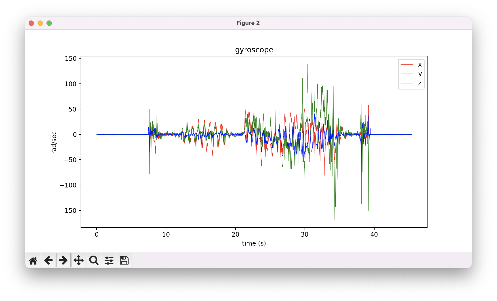
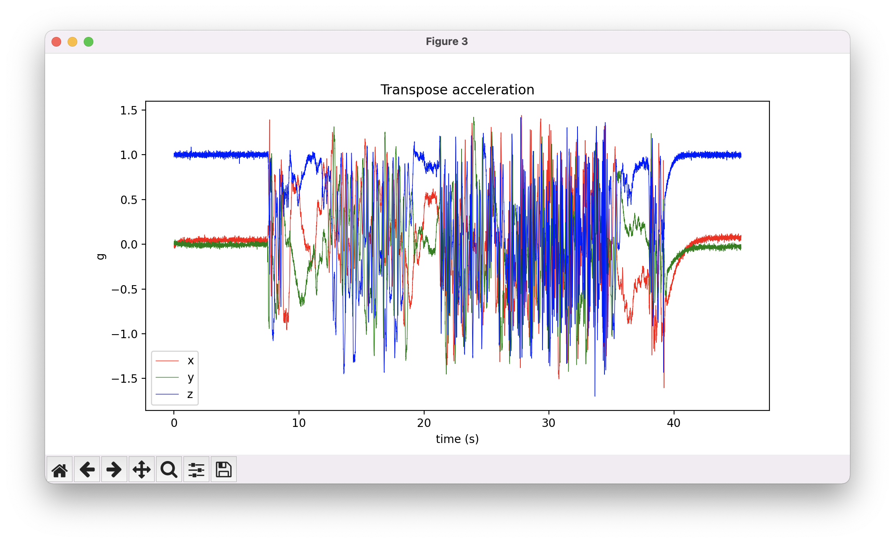
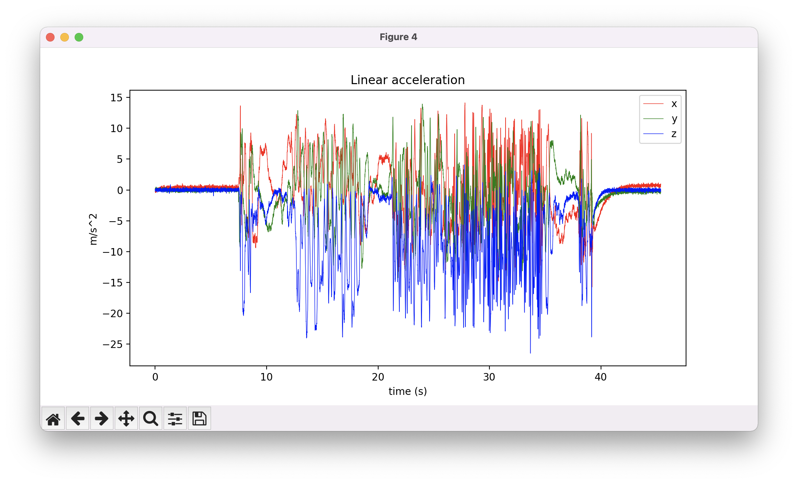
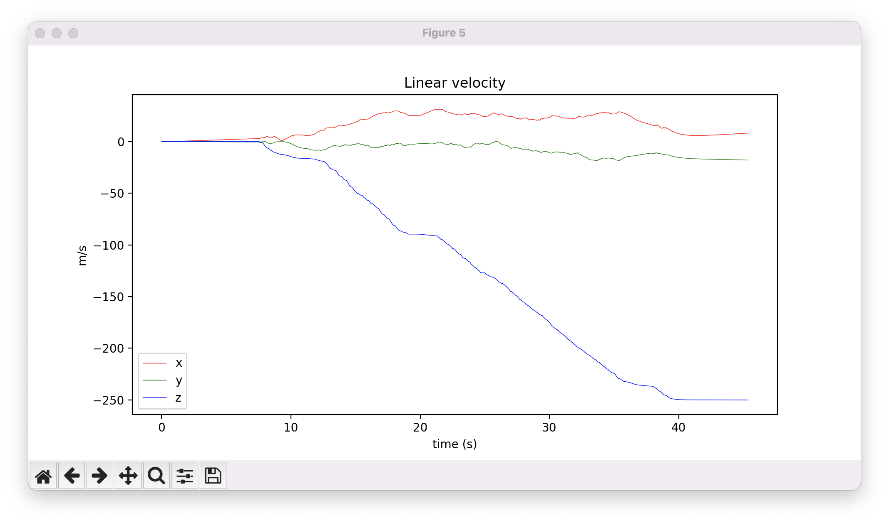
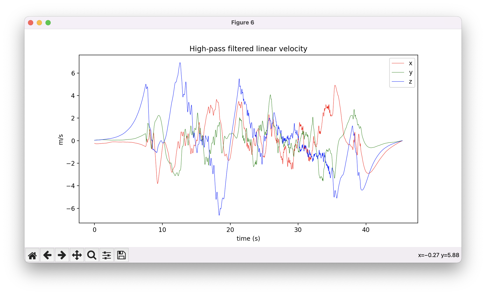
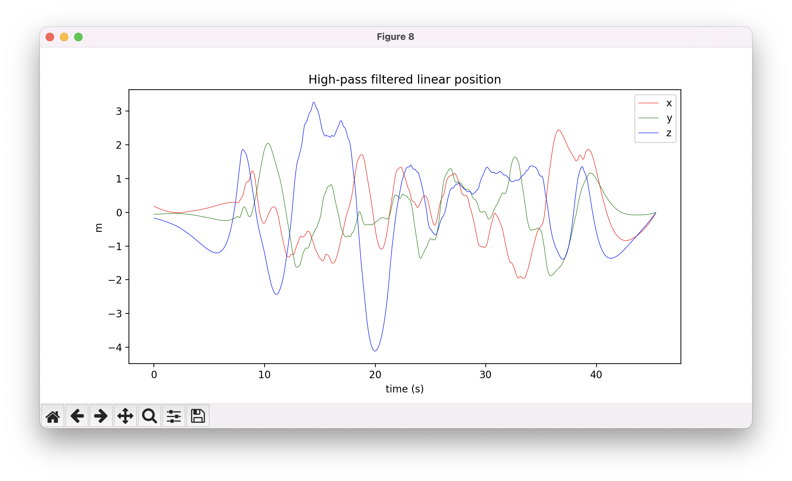

| Python                               | MATLAB |
|--------------------------------------|--------|
|   |        |
|      |        |
|  |        |
|     |        |
|     |        |
|  |        |
|     |        |
|  |        |
