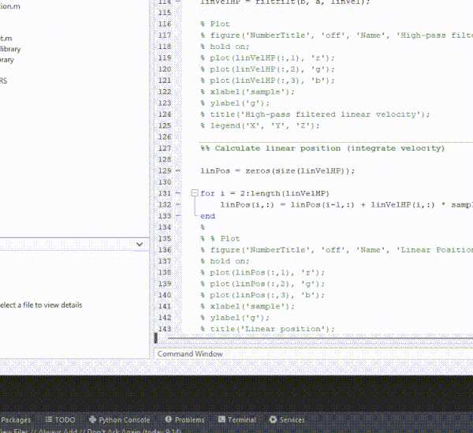

**[English](REAMDE.md)** | [Українська](README_UA.md)

# Oscillatory-Motion-Tracking-With-x-IMU-Python

Python realization of [Oscillatory-Motion-Tracking-With-x-IMU](https://github.com/xioTechnologies/Oscillatory-Motion-Tracking-With-x-IMU).

Tracking movements of IMU sensor. Trajectory demonstration of movements.

`ximu_python_library` was taken from [Gait-Tracking-With-x-IMU-Python](https://github.com/daehwa/Gait-Tracking-With-x-IMU-Python) project.


## Installation

For using this code you need to clone repo:

```shell
git clone https://github.com/Korzhak/Oscillatory-Motion-Tracking-With-x-IMU-Python
cd Oscillatory-Motion-Tracking-With-x-IMU-Python
```

Making a virtual environment and install dependencies:

```shell
virtualenv -p python3 venv
. venv/bin/activate

pip install -r requirements.txt
```

Running the script which calculate rotation matrix and position:

```shell
python script.py
```

Running the script for visualization of movements in 3D:

```shell
python SixDOFAnimation.py
```


## Visualization and charts

| Python                           | MATLAB                                |
|----------------------------------|---------------------------------------|
|   |  |

To view all charts follow [the link](charts/CHARTS.md) or push image below:

[](charts/CHARTS.md)
