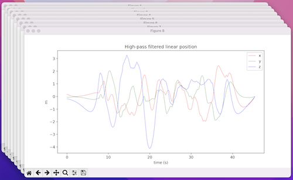

# Oscillatory-Motion-Tracking-With-x-IMU-Python

This project is realization of [Oscillatory-Motion-Tracking-With-x-IMU](https://github.com/xioTechnologies/Oscillatory-Motion-Tracking-With-x-IMU) on Python.

I didn't make AHRS Mahony filter. I am using the existing [ahrs](https://github.com/Mayitzin/ahrs) library.
It contains class of Mahony filter and class for working with Quaternions.

`ximu_python_library` was taken from [Gait-Tracking-With-x-IMU-Python](https://github.com/daehwa/Gait-Tracking-With-x-IMU-Python) project.

## Installation

For using this code you need to clone repo:

```shell
git clone https://github.com/Korzhak/Oscillatory-Motion-Tracking-With-x-IMU-Python
cd Oscillatory-Motion-Tracking-With-x-IMU-Python
```

Making a virtual environment and install dependencies:

```shell
virtualenv -p python3 venv
. venv/bin/activate

pip install -r requirements.txt
```

And finally, running the project:

```shell
python script.py
```

## Charts

To view all charts follow [the link](CHARTS.md) (or push image below)

[](CHARTS.md)
