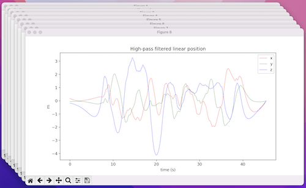

[English](README.md) | **[Українська](README_UA.md)**

# Oscillatory-Motion-Tracking-With-x-IMU-Python

Python реалізація [Oscillatory-Motion-Tracking-With-x-IMU](https://github.com/xioTechnologies/Oscillatory-Motion-Tracking-With-x-IMU).

Відстежування рухів IMU давача. Побудова траєкторії руху.

Використовується `фільтр Магоні` з бібліотеки [ahrs](https://github.com/Mayitzin/ahrs).

`ximu_python_library` була взята з проекту [Gait-Tracking-With-x-IMU-Python](https://github.com/daehwa/Gait-Tracking-With-x-IMU-Python).

## Встановлення

Для використання даного коду Вам потрібно клонувати репозиторій:

```shell
git clone https://github.com/Korzhak/Oscillatory-Motion-Tracking-With-x-IMU-Python
cd Oscillatory-Motion-Tracking-With-x-IMU-Python
```

Створити віртуальне середовище та встановити залежності:

```shell
virtualenv -p python3 venv
. venv/bin/activate

pip install -r requirements.txt
```

І на сам кінець, запустити проєкт:

```shell
python script.py
```

## Візуалізація

Щоб переглянути всі графіки перейдіть за [посиланням](charts/CHARTS.md), або натисніть на зображення внизу:

[](charts/CHARTS.md)
