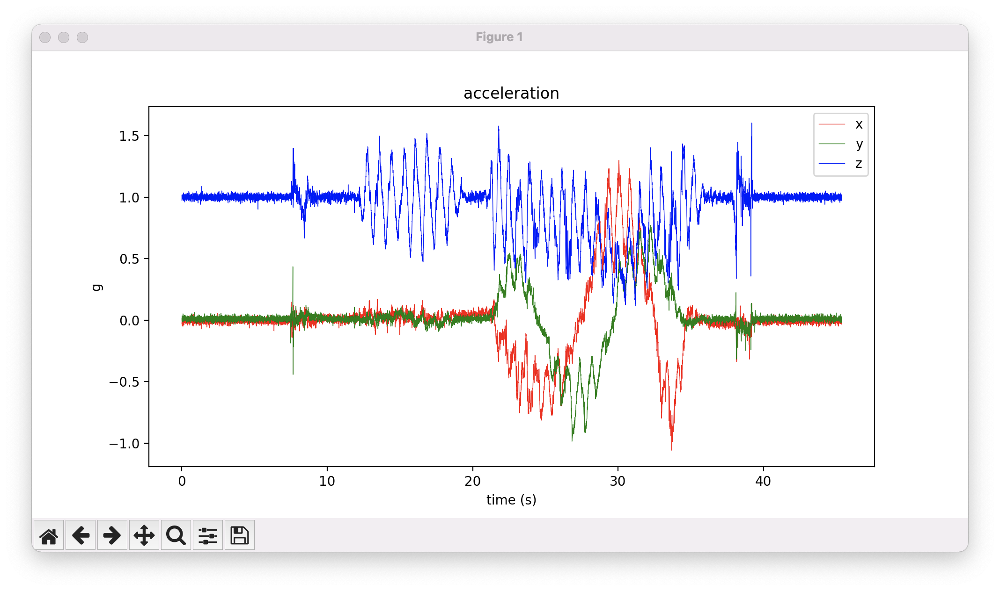
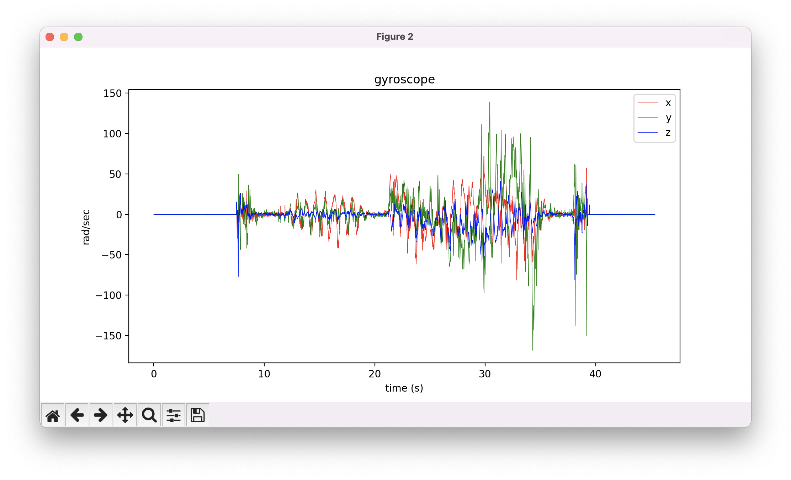
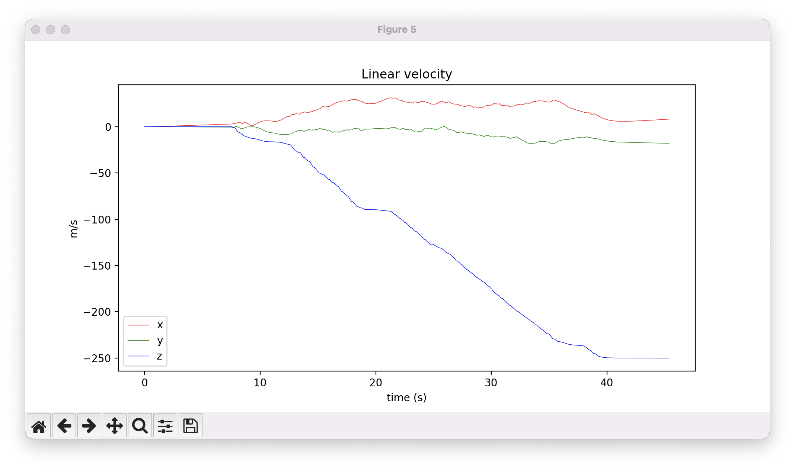
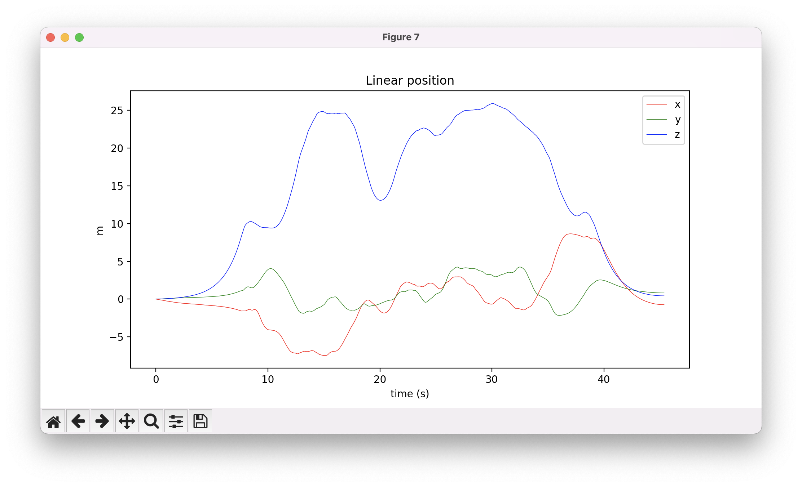
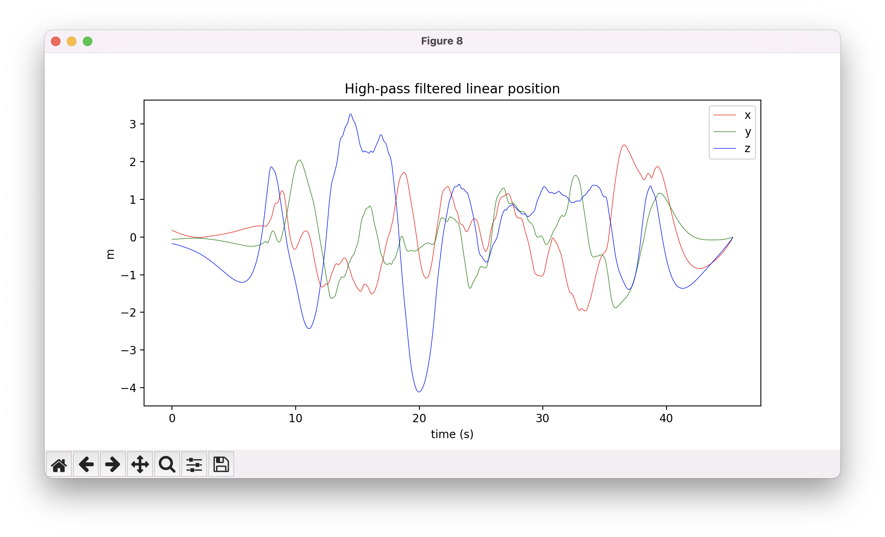

| Python                      | MATLAB |
|-----------------------------|--------|
|      |        |
|         |        |
|     |        |
|        |        |
|        |        |
|     |        |
|        |        |
|     |        |
