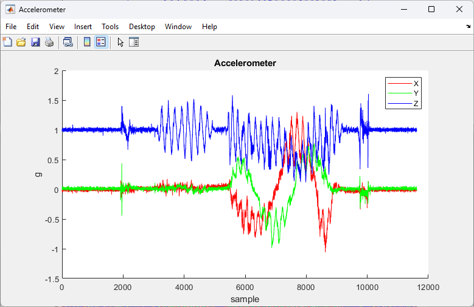
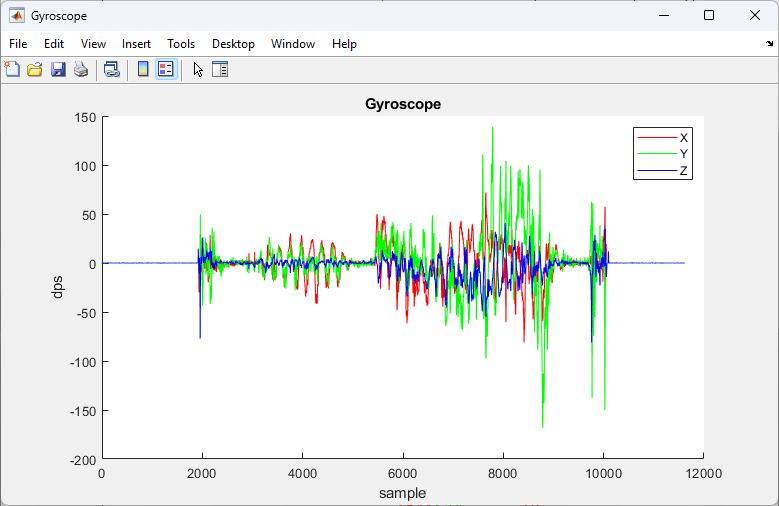
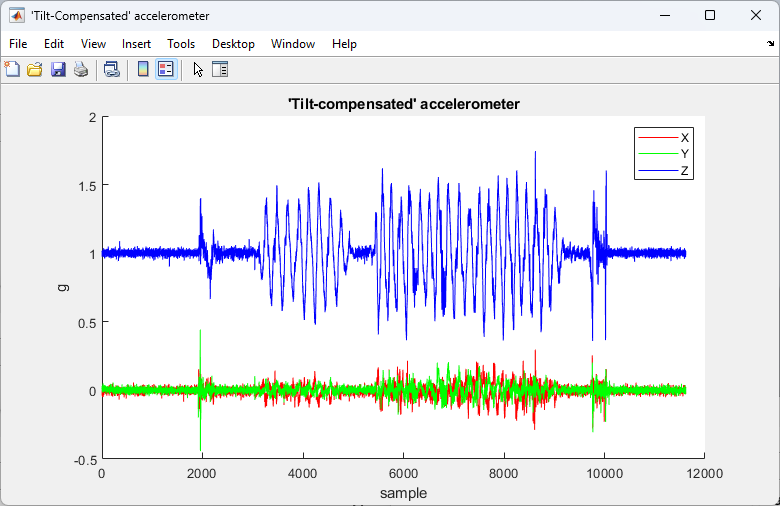
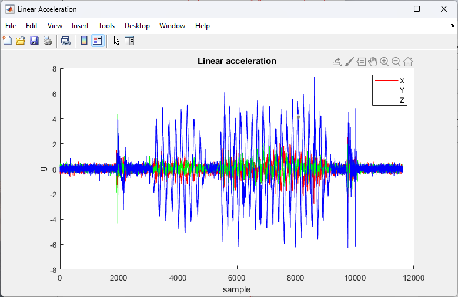
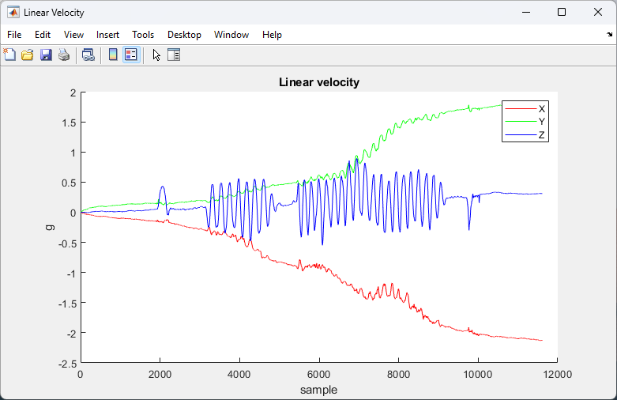
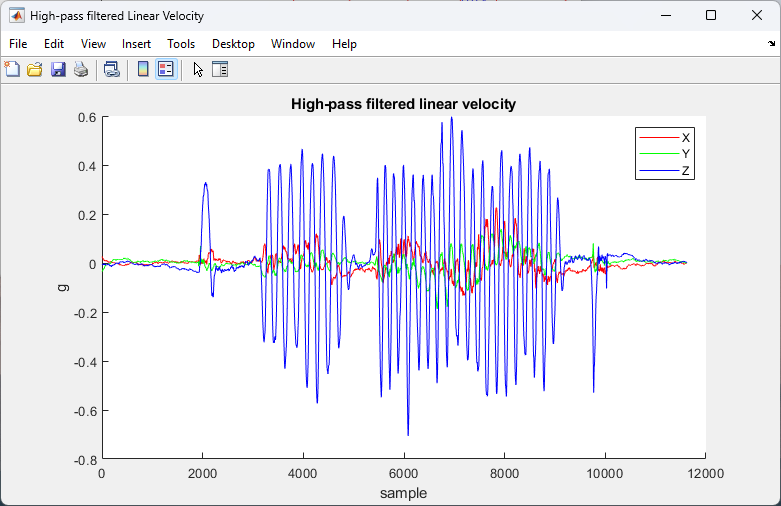
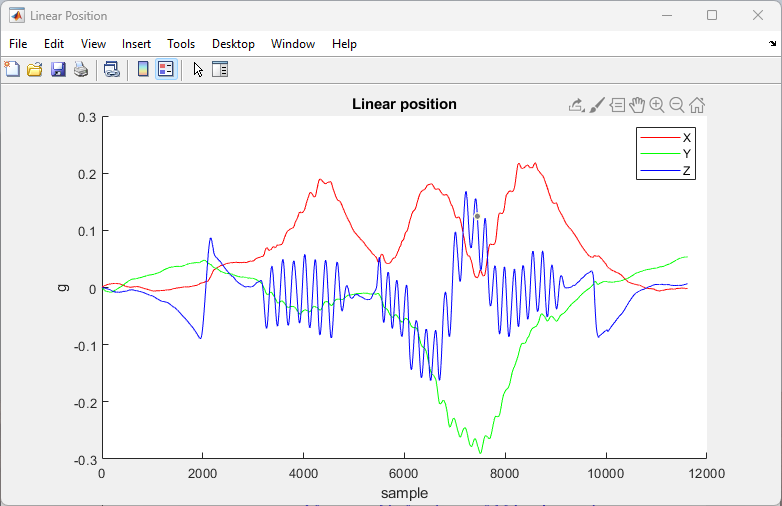
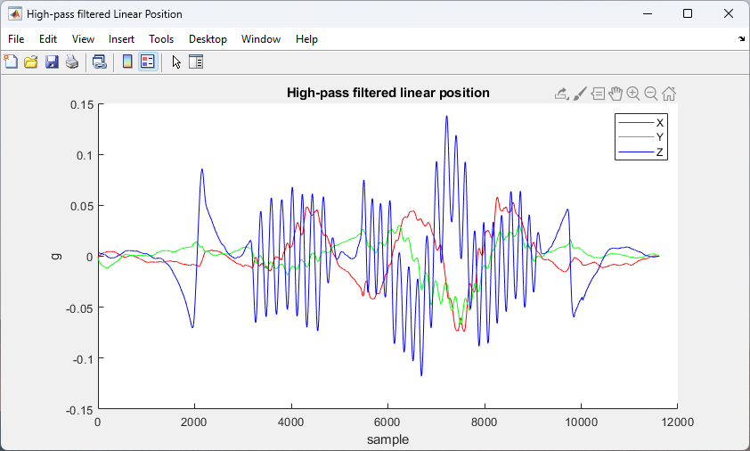

| Python                      | MATLAB            |
|-----------------------------|-------------------|
|      |  |
|         |  |
|     |  |
|        |  |
|        |  |
|     |  |
|        |  |
|     |  |
